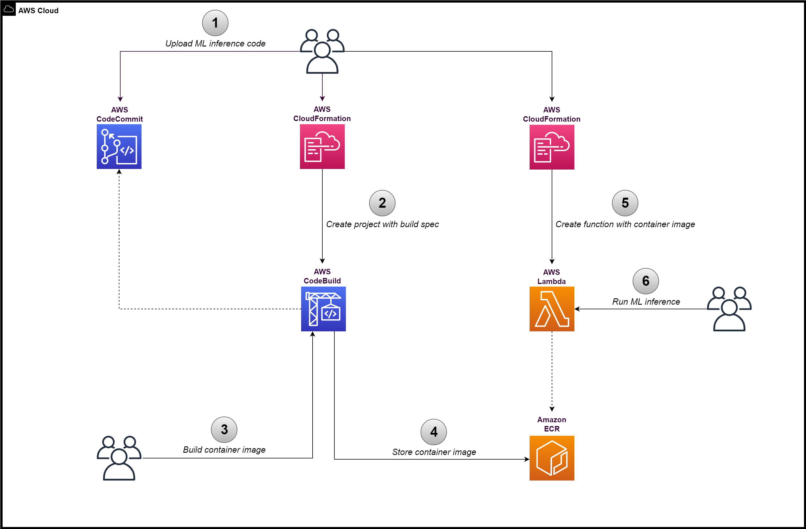

# Run ML inference on Lambda arm64 (AWS Graviton) using ArmNN

This sample provides steps to deploy ArmNN on AWS Lambda (arm64) by building and loading a container image. The Lambda function will be used to perform ML inference using an example image classification ML model in ONNX format (ResNet 50).

## Overview

[ArmNN](https://github.com/ARM-software/armnn) is an open-source software library that optimises the execution of ML workloads on Arm-based processors and uses the [Arm Compute Library - ACL](https://github.com/ARM-software/ComputeLibrary). It is one of the options available to perform CPU-based machine learning inference on [Graviton](https://aws.amazon.com/ec2/graviton/) instances.

## Prerequisites

* Ensure the AWS region selected supports [CodeBuild Arm containers](https://docs.aws.amazon.com/codebuild/latest/userguide/build-env-ref-compute-types.html)

## Limitations

* Any changes to the ML inference code require re-building the Docker container image and re-deploying it on Lambda
* ArmNN supports only 2 file formats: ONNX and TfLite. Since TfLite is typically used in edge devices (i.e. mobile) with lightweight models, the example provided here is a ResNet model in ONNX format

## Architecture



## Instructions

### Step 1. Prepare code repository

Go to service AWS CodeCommit to create a new code repository. Upload to it the 2 files: [Dockerfile](./src/Dockerfile) and [app.py](./src/app.py) from this repository.

### Step 2. Build Docker container image

#### Create Codebuild project

Go to service AWS CloudFormation and create a new stack using the [CodeBuild template](./src/DeployCodeBuildProject-Cfn.yaml).

Parameters to provide:

- **CodeCommitRepositoryName**: provide name given in Step 1

- **ContainerImageName**: provide a name for the container image that will be created

#### Run build

Go to service AWS CodeBuild to locate the created project and to start a build to produce the Docker container image.

Go to service Amazon ECR and confirm the built container image is published there.

### Step 3. Deploy Lambda function

Go to service AWS CloudFormation and create a new stack using the [Lambda template](./src/DeployLambdaContainerImage-Cfn.yaml).

Parameters to provide:

- **LambdaMemorySize**: specify amount of memory required by ML inference code

The example code uses approximately 0.9GB of memory, however Lambda supports up to 3GB or 10GB depending on region availability.

### Step 4. Run ML Inference

Go to service AWS Lambda to view the function created in Step 3.

Test the ML inference code with a sample image by using this event:

```
{
  "image_url": "<<PROVIDE_IMAGE_URL>>"
}
```

Example image URL: https://s3.amazonaws.com/model-server/inputs/kitten.jpg

Confirm the output of the test shows the image classification results. Ignore the additional log output.

## References

* PyArmNN: https://github.com/ARM-software/armnn/tree/branches/armnn_22_02/python/pyarmnn
* ONNX model: https://github.com/onnx/models/blob/main/vision/classification/resnet/model/resnet50-v1-7.onnx
* ONNX model labels: https://s3.amazonaws.com/onnx-model-zoo/synset.txt

## Additional Information

* To learn more about Lambda support for the arm64 architecture: https://docs.aws.amazon.com/lambda/latest/dg/foundation-arch.html
* For workloads which require more resources than Lambda provides, Amazon ECS or AWS Fargate are suitable alternatives to deploy the container image to. To learn more about ECS support for arm64 architecture: https://docs.aws.amazon.com/AmazonECS/latest/developerguide/ecs-arm64.html

## Contributing

See [CONTRIBUTING](./CONTRIBUTING.md) for more information.

## License

This sample code is made available under a MIT-0 license. See the [LICENSE](./LICENSE) file.
